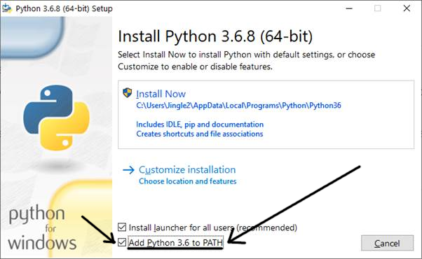

# Installing A→Z+T

## TL;DR
You need Python 3+ and _one_ dependency ([PyAudio](https://pypi.org/project/PyAudio/)) to run A→Z+T. Download [this repository (https://github.com/kent-rasmussen/azt)](https://github.com/kent-rasmussen/azt.git), and run `main.py`. If this is enough information for you, great; if not, please read this whole document, or follow the [simple install instructions](SIMPLEINSTALL.md).

## Error Tracking
If you have *any* trouble with anything on this page, please copy all error messages and paste them into an Email to me and/or Google.

If you click on an icon and get a flash and nothing more, you may need to run python from a command terminal (`⊞ win`+`R` then type 'cmd' in Windows) to see what errors are keeping it from running.

## Download A→Z+T
To get the program, either

- run `git clone https://github.com/kent-rasmussen/azt.git` (in terminal)
    - You may need to install Git (e.g. [here](https://git-scm.com/download/win) or [here](https://desktop.github.com/)) first, or
- click on the green `code` button on the [main page](https://github.com/kent-rasmussen/azt.git) for download options.

If you download an archive (e.g., zip file), extract it so you have a folder of files. Either way, put it somewhere sensible, so you can find it later. If you use `git clone`, you can update in the future with `git pull`, and just download the changes since you last updated.

## Python
*If* you need to install [Python](https://python.org) (you may already have it), you can find it [here](https://python.org).
- If you have more than one version of python installed (e.g. 2.7 and 3.6.8), be sure to know how to run version 3 for this program (may be called `python` or `python3`).

### Installation on Ubuntu Linux
This should get you all the necessary packages: `sudo apt-get install python3-tk python3-pip portaudio19-dev` (add optional texlive-xetex below)
Then this will get you the needed python modules: `python3 -m pip install pyaudio tkinter lxml Pillow` The last two are not necessary, but helpful, and not much extra to do at this point.

### Installation on Microsoft Windows
- **Be sure to check "add to PATH"** (or whatever options are appropriate), so Windows knows where Python is installed. If you miss this step, A→Z+T will not work:

)

For some reason, I have had trouble getting pyaudio installed on Windows machines with most recent versions of Python (3.9). You may have better mileage than I. In any case, I have found that it works smoothly to download and install Python 3.6.8 (e.g., from [here](https://www.python.org/ftp/python/3.6.8/python-3.6.8-amd64.exe)).

## Dependencies
- Depending on how Python is installed on your system, you may also need
    - `tkinter`. On Ubuntu, `sudo apt-get install python3-tk` is sufficient to do this.
    - `pip`. On Ubuntu, `sudo apt-get install python3-pip` is sufficient to do this.
- [PyAudio](https://pypi.org/project/PyAudio/): to install, run `python -m pip install pyaudio` in a terminal (e.g., `⊞ win`+`R` then type 'cmd' in Windows).
    - On Windows, if the above gives you problems, it may work to do the following:
        - `python -m pip install pipwin`
        - `pipwin install pyaudio`
        - to get optional dependencies, too: `pipwin install Pillow` and `pipwin install lxml` (one at a time)
    - On Linux (and Mac?), `pyaudio` may in turn have a dependency of `portaudio19-dev`, which you should install with your package manager (e.g., `sudo apt-get install portaudio19-dev`).

### Optional dependency: PIL/Pillow
This install allows for visual rendering of tone glyphs that aren't currently working in tkinter:
`python -m pip install --upgrade pip` (if your pip hasn't been upgraded recently)
`python -m pip install --upgrade Pillow`
If you have any problem installing this, it is not a problem for using AZT —you will simply see tone marks badly ligatured, like (˦ ˦ ˨ ˨ ˥ ˩ ˦) instead of like (˦˦ ˨˨ ˥˩˦).

### Optional dependency: lxml
This is just required to compile reports into PDF. If you're not doing that (e.g.,plan on compiling yourself through XXE anyway), you don't need this:
`python -m pip install lxml`

### Optional dependency: XeLaTeX
[A→Z+T](https://github.com/kent-rasmussen/azt.git) will eventually try to produce the first draft of reports directly to PDF. In order for this to work, you must have [XeLaTeX](https://www.latex-project.org/get/) installed:
- Debian/Ubuntu Linux: `sudo apt-get install texlive-xetex`
- MS Windows: There are many ways to do this, e.g.,
    - [https://www.latex-project.org/get/](https://www.latex-project.org/get/)
    - [Google "XeLaTeX Windows"](https://www.google.com/search?q=XeLaTeX+Windows)

## XLingPaper and the XMLmind XML Editor (XXE)
To make full use of A→Z+T's report output, I strongly advise you to be ready to use [XLingPaper](https://software.sil.org/xlingpaper/), if you are not already. It can be downloaded [here](https://software.sil.org/xlingpaper/download); this page also includes information on downloading [the XMLmind XML Editor (XXE)](http://www.xmlmind.com/xmleditor/), which is critical to most uses of [XLingPaper](https://software.sil.org/xlingpaper/).

## Praat
If you have [Praat](https://www.fon.hum.uva.nl/praat/) installed, [A→Z+T](https://github.com/kent-rasmussen/azt.git) can open sound files you have recorded there for you.

## To run AZT
Assuming your system is configured correctly, just run `main.py`. Depending on your system, that may be just a click on the file (or a link to it on your desktop or wherever), or you may need to type that into a terminal. Your operating system should know to open `main.py` with python, but you can also explicitly tell it to with `python main.py`.

For usage information, see [USAGE](USAGE.md)
