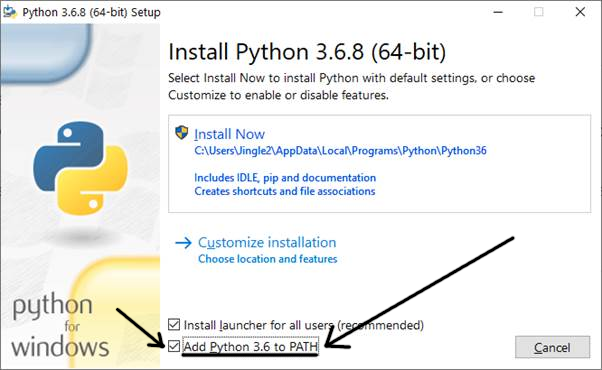

# Simple and Straightforward Instructions for Installing A-Z+T on MS Windows
## (Or just run [this script](../installfiles/RunMetoInstall.bat?raw=true) as administrator.)
This document offers instructions with **exactly one set of options**; to explore more options, see [INSTALL](INSTALL.md).

For simple install instructions for Ubuntu Linux, see [SIMPLEINSTALL_LINUX](SIMPLEINSTALL_LINUX.md).

If any of the following fails, please [write me](BUGS.md), including your logs and copy/pasting all errors you find into the Email ([this page](FINDERRORLOGS.md) can help you find your logs).

Before you can [Set up A-Z+T for normal use](#set-up-azt-for-normal-use), you need to do two things:
1. [Install Python](#install-python)
2. [Install Git and Download A-Z+T](#install-git-and-download-azt)

## Install Python
1. Download and install Python from [here](https://www.python.org/ftp/python/3.12.4/python-3.12.4-amd64.exe). At this step:

**Be sure to check "add to PATH"** during the install process. **If you don't do this**, you will likely need to ask your local IT support for help adding Python to your path. While you are waiting for the download, you can start on [Install Git and Download A-Z+T](#install-git-and-download-azt) below

**Be sure to click on "remove path limitation"** after the above, to avoid certain problems with longer filenames.

2. **This should be obsolete; skip unless you have problems later**: Open a terminal (hit the Windows key then type `cmd` in the search box), and paste each of these (and hit enter):
    - `python -m pip install --upgrade pip setuptools wheel`
    - `python -m pip install pyaudio`
    - `python -m pip install Pillow lxml` (not required; if you get an error here, just skip it)
    - `python -m pip install patiencediff` (not required as of Jan 2022; if you get an error here, just skip it)

## Install Git and Download A-Z+T

### Install Git ([website](https://git-scm.com/download/win))
1. Download and install Git from [here](https://github.com/git-for-windows/git/releases/download/v2.33.0.windows.2/Git-2.33.0.2-64-bit.exe)

### Download A-Z+T
1. On your Desktop, right click select `Git-Bash` to get a terminal (black window).
2. In the `Git-Bash` terminal, paste `git clone https://github.com/kent-rasmussen/azt.git` and hit enter. This will give you an `azt` folder on your desktop, where the A-Z+T program files will stay.

## Fonts
If you don't already have [Charis SIL](https://software.sil.org/charis/) on your system, download and install the most recent version from [here](https://software.sil.org/downloads/r/charis/CharisSIL-6.001.zip).

## First Run of A−Z+T
The first time you run A−Z+T, it will check that you have all the necessary python modules installed. If you don't, this isn't a problem, but it will take a moment and install them for you. If you run into problems installing pyaudio (especially ones including `Microsoft Visual C++`), it may help to run these two commands
- `python -m pip install pipwin`
- `pipwin install pyaudio`

## Set up A-Z+T for normal use
Once you have completed everything under [Install Python](#install-python) and [Install Git and Download A-Z+T](#install-git-and-download-azt):
1. Click to open the `azt` folder on your desktop
2. **Right click** on `main.py` (it may appear as `main` on your system), and select "Send to... Desktop (create shortcut)".
3. Click on the shortcut/link to run A-Z+T (if you get nothing but a black flicker, see [this page](INSTALL_PROBLEMS.md).)
4. **Celebrate your accomplishment; you're done installing A-Z+T!**
5. Read [USAGE](USAGE.md) for how to use A-Z+T
6. Send me information on any [bugs](BUGS.md) you find, so I can help you and improve the program for others.

## Additional Important Steps to get the most out of A-Z+T

### Install Mercurial for better collaboration
Download and install [this file](https://www.mercurial-scm.org/release/windows/Mercurial-6.0-x64.exe).

### Praat
- If you use Praat, make sure the Praat executable is in your operating system's path. You may need to ask your IT support for help, if you don't know how to do this (Basically, put it in your `Programs (?x86)` directory).

### Be ready to make and edit reports
Install the full XLingPaper package from [here](https://software.sil.org/downloads/r/xlingpaper/XLingPaper3-10-1XXEPersonalEditionFullSetup.exe).

### Update A-Z+T from the Help menu, assuming you have followed these instructions.
